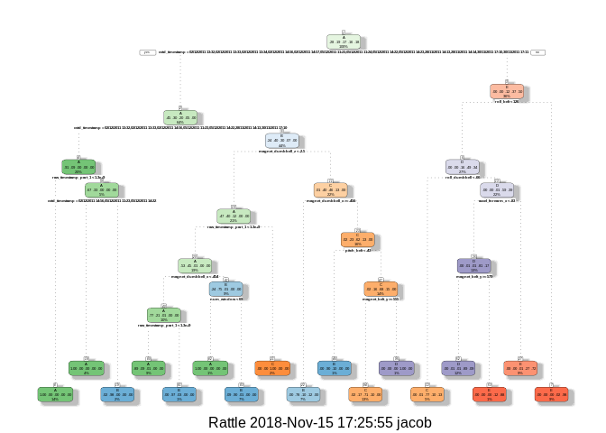
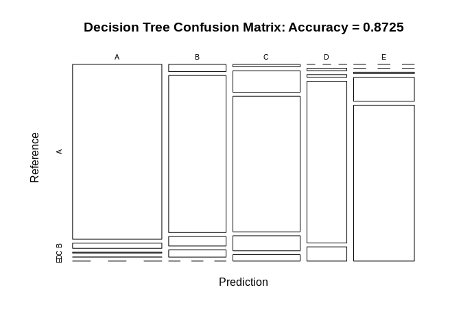
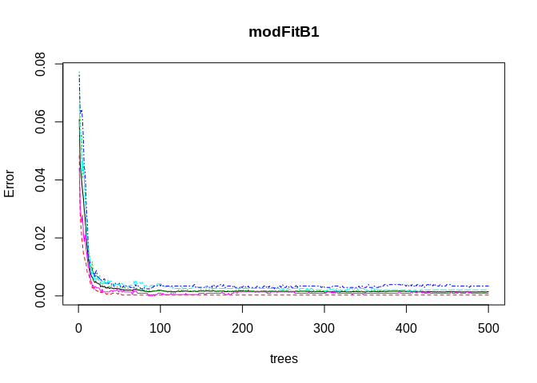
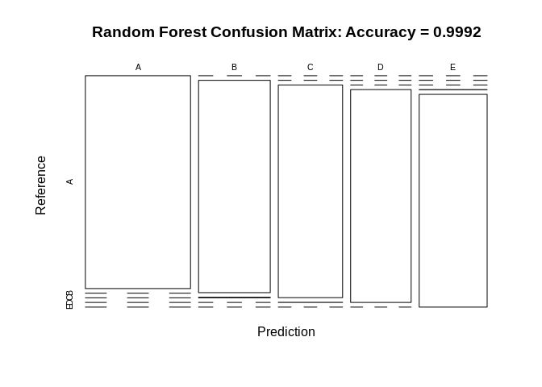
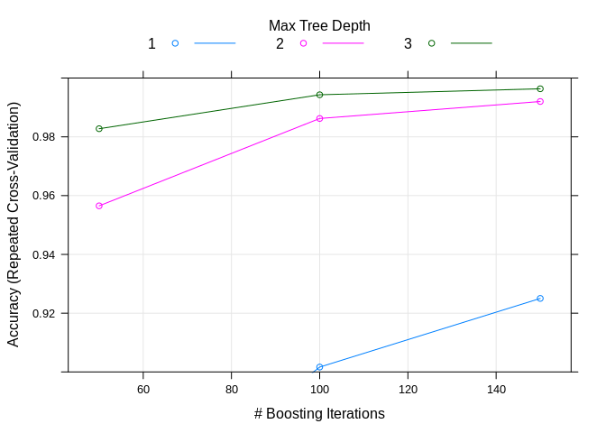

# Human Activity Recognition

+ _title: "Human Activity Recognition"_
+ _author: "Puxin Xu"_
+ _date: "January 22, 2016"_

----------

    library(lattice)
    library(ggplot2)
    library(caret)
    library(rpart)
    library(rpart.plot)
    library(RColorBrewer)
    library(rattle)
    library(randomForest)
    library(knitr)
    library(e1071)

Background
----------

Using devices such as Jawbone Up, Nike FuelBand, and Fitbit it is now
possible to collect a large amount of data about personal activity
relatively inexpensively. These type of devices are part of the
quantified self movement ?C a group of enthusiasts who take measurements
about themselves regularly to improve their health, to find patterns in
their behavior, or because they are tech geeks. One thing that people
regularly do is quantify how much of a particular activity they do, but
they rarely quantify how well they do it. In this project, your goal
will be to use data from accelerometers on the belt, forearm, arm, and
dumbell of 6 participants. They were asked to perform barbell lifts
correctly and incorrectly in 5 different ways. More information is
available from the website here:
<http://groupware.les.inf.puc-rio.br/har> (see the section on the Weight
Lifting Exercise Dataset).

Data
----

The training data for this project are available here:
<https://d396qusza40orc.cloudfront.net/predmachlearn/pml-training.csv>

The test data are available here:
<https://d396qusza40orc.cloudfront.net/predmachlearn/pml-testing.csv>

The data for this project come from this source:
<http://groupware.les.inf.puc-rio.br/har> . If you use the document you
create for this class for any purpose please cite them as they have been
very generous in allowing their data to be used for this kind of
assignment.

Getting and Cleaning the data
-----------------------------

### Getting the data

    if (!dir.exists("data")) { 
    dir.create("./data")}
    setwd("./data")
    fileUrl_training <- "https://d396qusza40orc.cloudfront.net/predmachlearn/pml-training.csv"
    download.file(fileUrl_training, destfile = "./pml-training.csv")
    fileUrl_testing <- "https://d396qusza40orc.cloudfront.net/predmachlearn/pml-testing.csv"
    download.file(fileUrl_testing, destfile = "./pml-testing.csv")
    training <- read.csv("pml-training.csv", na.strings=c("NA","#DIV/0!",""))
    testing <- read.csv("pml-testing.csv", na.strings=c("NA","#DIV/0!",""))

### Cleaning the data

    nzv <- nearZeroVar(training, saveMetrics=TRUE)
    training <- training[,nzv$nzv==FALSE]
    training <- training[c(-1)]
    trainingtemp <- training
    for(i in 1:length(training)) {
        if( sum( is.na( training[, i] ) ) /nrow(training) >= .7) {
            for(j in 1:length(trainingtemp)) {
                if( length( grep(names(training[i]), names(trainingtemp)[j]) ) == 1)  {
                    trainingtemp <- trainingtemp[ , -j]
                }   
            } 
        }
    }
    training <- trainingtemp
    rm(trainingtemp)
    inTrain <- createDataPartition(training$classe, p=0.6, list=FALSE)
    myTraining <- training[inTrain, ]
    myTesting <- training[-inTrain, ]
    clean1 <- colnames(myTraining)
    clean2 <- colnames(myTraining[, -58])
    myTesting <- myTesting[clean1]
    testing <- testing[clean2]
    for (i in 1:length(testing) ) {
        for(j in 1:length(myTraining)) {
            if( length( grep(names(myTraining[i]), names(testing)[j]) ) == 1)  {
                class(testing[j]) <- class(myTraining[i])
            }      
        }      
    }
    testing <- rbind(myTraining[2, -58] , testing)
    testing <- testing[-1,]

Prediction
----------

### Decision Trees

    set.seed(123456)
    modFitA1 <- rpart(classe ~ ., data=myTraining, method="class")
    fancyRpartPlot(modFitA1)

    predictionsA1 <- predict(modFitA1, myTesting, type = "class")
    cmtree <- confusionMatrix(predictionsA1, myTesting$classe)
    cmtree

    ## Confusion Matrix and Statistics
    ## 
    ##           Reference
    ## Prediction    A    B    C    D    E
    ##          A 2140   68    6    4    0
    ##          B   65 1262   83   65    0
    ##          C   27  180 1257  222   56
    ##          D    0    8   22  939  179
    ##          E    0    0    0   56 1207
    ## 
    ## Overall Statistics
    ##                                           
    ##                Accuracy : 0.8673          
    ##                  95% CI : (0.8596, 0.8748)
    ##     No Information Rate : 0.2845          
    ##     P-Value [Acc > NIR] : < 2.2e-16       
    ##                                           
    ##                   Kappa : 0.8322          
    ##  Mcnemar's Test P-Value : NA              
    ## 
    ## Statistics by Class:
    ## 
    ##                      Class: A Class: B Class: C Class: D Class: E
    ## Sensitivity            0.9588   0.8314   0.9189   0.7302   0.8370
    ## Specificity            0.9861   0.9663   0.9251   0.9681   0.9913
    ## Pos Pred Value         0.9648   0.8556   0.7216   0.8179   0.9557
    ## Neg Pred Value         0.9837   0.9598   0.9818   0.9482   0.9643
    ## Prevalence             0.2845   0.1935   0.1744   0.1639   0.1838
    ## Detection Rate         0.2728   0.1608   0.1602   0.1197   0.1538
    ## Detection Prevalence   0.2827   0.1880   0.2220   0.1463   0.1610
    ## Balanced Accuracy      0.9724   0.8988   0.9220   0.8492   0.9141

    plot(cmtree$table, col = cmtree$byClass, main = paste("Decision Tree Confusion Matrix: Accuracy =", round(cmtree$overall['Accuracy'], 4)))

### Random Forests

    set.seed(123456)
    modFitB1 <- randomForest(classe ~ ., data=myTraining)
    predictionB1 <- predict(modFitB1, myTesting, type = "class")
    cmrf <- confusionMatrix(predictionB1, myTesting$classe)
    cmrf

    ## Confusion Matrix and Statistics
    ## 
    ##           Reference
    ## Prediction    A    B    C    D    E
    ##          A 2229    1    0    0    0
    ##          B    3 1517    2    0    0
    ##          C    0    0 1364    8    0
    ##          D    0    0    2 1278    5
    ##          E    0    0    0    0 1437
    ## 
    ## Overall Statistics
    ##                                           
    ##                Accuracy : 0.9973          
    ##                  95% CI : (0.9959, 0.9983)
    ##     No Information Rate : 0.2845          
    ##     P-Value [Acc > NIR] : < 2.2e-16       
    ##                                           
    ##                   Kappa : 0.9966          
    ##  Mcnemar's Test P-Value : NA              
    ## 
    ## Statistics by Class:
    ## 
    ##                      Class: A Class: B Class: C Class: D Class: E
    ## Sensitivity            0.9987   0.9993   0.9971   0.9938   0.9965
    ## Specificity            0.9998   0.9992   0.9988   0.9989   1.0000
    ## Pos Pred Value         0.9996   0.9967   0.9942   0.9946   1.0000
    ## Neg Pred Value         0.9995   0.9998   0.9994   0.9988   0.9992
    ## Prevalence             0.2845   0.1935   0.1744   0.1639   0.1838
    ## Detection Rate         0.2841   0.1933   0.1738   0.1629   0.1832
    ## Detection Prevalence   0.2842   0.1940   0.1749   0.1638   0.1832
    ## Balanced Accuracy      0.9992   0.9993   0.9979   0.9964   0.9983

    plot(modFitB1)

    plot(cmrf$table, col = cmtree$byClass, main = paste("Random Forest Confusion Matrix: Accuracy =", round(cmrf$overall['Accuracy'], 4)))

### Generalized Boosted Regression

    library(survival)
    library(gbm)
    library(splines)
    library(parallel)
    library(plyr)
    set.seed(123456)
    fitControl <- trainControl(method = "repeatedcv",
                               number = 5,
                               repeats = 1)

    gbmFit1 <- train(classe ~ ., data=myTraining, method = "gbm",
                     trControl = fitControl,
                     verbose = FALSE)
    gbmFinMod1 <- gbmFit1$finalModel
    gbmPredTest <- predict(gbmFit1, newdata=myTesting)
    gbmAccuracyTest <- confusionMatrix(gbmPredTest, myTesting$classe)
    gbmAccuracyTest

    ## Confusion Matrix and Statistics
    ## 
    ##           Reference
    ## Prediction    A    B    C    D    E
    ##          A 2231    1    0    0    0
    ##          B    1 1517    2    0    0
    ##          C    0    0 1358    7    0
    ##          D    0    0    8 1279    5
    ##          E    0    0    0    0 1437
    ## 
    ## Overall Statistics
    ##                                          
    ##                Accuracy : 0.9969         
    ##                  95% CI : (0.9955, 0.998)
    ##     No Information Rate : 0.2845         
    ##     P-Value [Acc > NIR] : < 2.2e-16      
    ##                                          
    ##                   Kappa : 0.9961         
    ##  Mcnemar's Test P-Value : NA             
    ## 
    ## Statistics by Class:
    ## 
    ##                      Class: A Class: B Class: C Class: D Class: E
    ## Sensitivity            0.9996   0.9993   0.9927   0.9946   0.9965
    ## Specificity            0.9998   0.9995   0.9989   0.9980   1.0000
    ## Pos Pred Value         0.9996   0.9980   0.9949   0.9899   1.0000
    ## Neg Pred Value         0.9998   0.9998   0.9985   0.9989   0.9992
    ## Prevalence             0.2845   0.1935   0.1744   0.1639   0.1838
    ## Detection Rate         0.2843   0.1933   0.1731   0.1630   0.1832
    ## Detection Prevalence   0.2845   0.1937   0.1740   0.1647   0.1832
    ## Balanced Accuracy      0.9997   0.9994   0.9958   0.9963   0.9983

    plot(gbmFit1, ylim=c(0.9, 1))

Prediction Results
------------------

`Random Forest` gives an Accuracy in the myTesting dataset of `99.89%`,
which was more accurate that what I got from the Decision Trees and GBM.
The expected `out-of-sample error` is 100%-99.89% = `0.11%`. Thus I
choose `Random Forest` to be the final predictor.

    predictionB2 <- predict(modFitB1, testing, type = "class")
    predictionB2

    ##  1  2  3  4  5  6 71  8  9 10 11 12 13 14 15 16 17 18 19 20 
    ##  B  A  B  A  A  E  D  B  A  A  B  C  B  A  E  E  A  B  B  B 
    ## Levels: A B C D E

Write the results to a text file for submission

    pml_write_files = function(x){
        n = length(x)
        for(i in 1:n){
            filename = paste0("problem_id_",i,".txt")
            write.table(x[i],file=filename,quote=FALSE,row.names=FALSE,col.names=FALSE)
        }
    }
    #pml_write_files(predictionB2)
